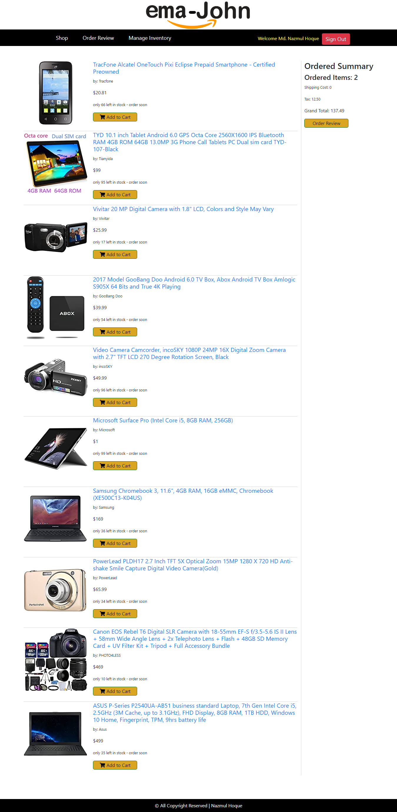

# Ema John Ecommerce site

It's a simple ecommerce system which developed with React.js, express.js, monogoDB & bootstrap.

## What's included
 - Showed different different types of Product item in home page.
 - Displayed Cart Product in Review Page
 - React Private Router is used for Shipment.
 - Authentication System (Google) is managed with firebase
 - Integrated Stripe Payment Gateway.
 - Backend API managed express.js
 - Used MongoDB as Database.

## Installation
### Prerequisites
In order to install Ema John simple website, the following prerequisites must be installed:
 - NPM 
 - Git

### Download
1. Open your command line and run:
```js
$ git clone https://github.com/nazmul98/shopping-app-with-react.git
```

### Installation Process
In order to install, the following steps must be taken:

1. Open your command line, go to the extracted folder and run:
```js
$  npm install
$  npm start
```

            **Congratulations, you have installed Ema John Ecommerce Website!**

### How I built it
The web application backend is built on express.js. Data is stored in a MongoDB database. The application will be hosted on firebase. React.js, JS ES6 features, Bootstrap4, HTML5 and CSS3 is used in the front-end.

### Useful Links
 - Demo: https://online-shopping-ctg.web.app/
 - Server: https://github.com/nazmul98/node-mongo

### Screenshot of Homepage
 